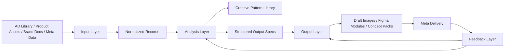

# AI Ad Image System Blueprint

## Goal

Use this workspace to rebuild a new ad-image system for Depology around a closed loop:

1. Input
2. Analysis
3. Output
4. Feedback

The new system should not be "prompt -> image" only.
It should become a reusable creative intelligence pipeline.

## Why Rebuild

The current repository is useful, but it is mainly a generation workspace:

- product asset loading
- prompt assembly
- single-run image generation
- result download
- partial Feishu sync

What is still missing:

- a structured winning-ad library
- reusable creative pattern extraction
- brand-aware reasoning artifacts
- output specs that are Figma-friendly
- campaign feedback feeding back into the next generation cycle

## Target Architecture

### 1. Input Layer

Purpose: collect and normalize all useful upstream material.

Main sources:

- AD Library winning ads
- Depology product PNGs
- brand documents
- product claims / landing-page copy
- campaign metadata
- historical performance data

Core outputs:

- normalized ad records
- product profiles
- brand context packs
- campaign context packs

### 2. Analysis Layer

Purpose: turn images and metadata into reusable creative logic.

Main jobs:

- image understanding
- layout decomposition
- visual motif extraction
- hook / promise / proof / CTA extraction
- audience-angle inference
- brand-fit scoring
- reusable pattern clustering

Core outputs:

- creative insight cards
- pattern library
- generation constraints
- Figma-ready composition suggestions

### 3. Output Layer

Purpose: generate structured creative proposals, not only final flat images.

Main jobs:

- generate ad concepts
- generate composition specs
- generate scene prompts
- generate text overlay suggestions
- generate modular assets for Figma finishing

Core outputs:

- concept briefs
- layout specs
- image prompts
- asset placement plans
- optional draft images

### 4. Feedback Layer

Purpose: use Meta delivery results to improve later cycles.

Main jobs:

- ingest campaign performance
- map performance back to concept / pattern / angle / audience
- score creative elements
- detect winners and fatigue
- update future generation priorities

Core outputs:

- performance reports
- pattern effectiveness scores
- next-cycle recommendations

## Proposed Data Flow



## Repository Mapping

The current `src/` folder can be treated as the legacy generation engine.

Recommended strategy:

- keep legacy generation scripts for experiments
- build the new system in parallel under a clearer structure
- move toward data-contract-driven workflows

## Recommended New Structure

```text
docs/
  ai-ad-system-blueprint.md

system/
  templates/
    ad-record.template.json
    creative-insight.template.json
    output-brief.template.json
    feedback-report.template.json

data/
  input/
    ad-library/raw/
    ad-library/normalized/
    brand/
    products/
    campaign-context/
  analysis/
    insights/
    patterns/
    scoring/
  output/
    concept-briefs/
    prompt-packs/
    figma-ready/
    draft-images/
  feedback/
    meta-exports/
    joined-reports/
```

## Core Entities

### Ad Record

Represents one source ad collected from AD Library or another inspiration source.

Suggested fields:

- `ad_id`
- `source_platform`
- `captured_at`
- `brand_name`
- `product_category`
- `image_paths`
- `video_paths`
- `landing_page_url`
- `ad_copy`
- `cta`
- `country`
- `language`
- `notes`

### Creative Insight

Represents the reasoning extracted from one or more ads.

Suggested fields:

- `insight_id`
- `source_ad_ids`
- `creative_type`
- `visual_structure`
- `hook_type`
- `proof_type`
- `product_role`
- `human_role`
- `background_style`
- `brand_fit`
- `reuse_score`
- `risks`
- `recommended_for`

### Output Brief

Represents a machine-readable creation request.

Suggested fields:

- `brief_id`
- `brand`
- `product`
- `target_audience`
- `objective`
- `selected_patterns`
- `required_elements`
- `forbidden_elements`
- `composition_spec`
- `copy_direction`
- `figma_handoff`

### Feedback Report

Represents performance linked back to creative decisions.

Suggested fields:

- `report_id`
- `campaign_id`
- `adset_id`
- `ad_id`
- `creative_brief_id`
- `pattern_ids`
- `ctr`
- `cpc`
- `cpa`
- `roas`
- `thumb_stop_score`
- `winner_signals`
- `fatigue_signals`
- `next_actions`

## Recommended Execution Order

### Phase 1: Build the Data Contracts

Focus first:

- define the JSON templates
- define directory conventions
- define naming rules
- define one end-to-end sample record per layer

This phase prevents the project from becoming another loose script collection.

### Phase 2: Build the Input Pipeline

Focus next:

- ingest AD Library material
- normalize product and brand materials
- create consistent IDs
- store all source references

### Phase 3: Build the Analysis Pipeline

Focus after input is stable:

- vision analysis
- structural decomposition
- pattern clustering
- brand-fit filtering

### Phase 4: Build the Output Pipeline

Focus on controlled generation:

- select patterns
- create structured briefs
- output prompts plus layout instructions
- produce Figma-ready modules

### Phase 5: Build Feedback Join

Focus last:

- import Meta metrics
- join results to briefs and patterns
- score which logic actually works

## Practical System Principle

The most important shift is:

- old mode: "generate an image"
- new mode: "generate and improve a creative system"

That means every generated image should be traceable back to:

- which inspiration ads influenced it
- which patterns were selected
- which brand constraints were applied
- which performance outcomes it later produced

## What To Reuse From Current Code

Can be reused or adapted:

- `src/productAssets.js`
- image generation clients
- image download / output helpers
- compositing utilities

Should be redesigned:

- direct prompt-only generation flow
- hardcoded concept lists
- loosely coupled experiment scripts

## Suggested First Build Milestone

A good first milestone for this repository:

1. Create normalized input records for 20-50 winning ads.
2. Create one analysis artifact per ad.
3. Cluster them into 5-10 repeatable creative patterns.
4. Generate 3 structured output briefs for one Depology product.
5. Export draft image prompts plus Figma handoff notes.

If this milestone works, the rest of the system becomes much easier to scale.
